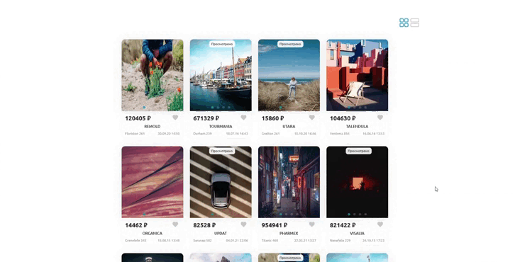

# Проект: React-Index

  

Веб-Приложение **React-Index**. В котором можно рассматривать фото продукта, с помощью ленивой карусели, которая экономит траффик. Можно лайкать и заходить на личную страницу данного продукта. К тому же реализована адаптивность под мобильные устройства. Есть кнопка для быстрого перемещения к началу страницы. При загрузке отображаются лоудеры.

***
### **Технологии**
* TypeScript
* React
  * Routing
* less
* react-slick
* content-loader

***

* [Ссылка на GitHub Pages](https://github.com/ri-yarm/react-index)
***
### **Требования**

На вашем компьютере должны быть установлены Node.js и npm. Этот проект был построен на следующих версиях:

* Node v18.13.0
* npm v8.9.13

### **Установка**

* Клонируйте этот репозиторий на свой компьютер
* Перейдите в папку проекта и запустите `npm install`
* Пропишите в консоли `npm run dev` и вы увидите в консоле адресс, перейдите по нему. По умолчанию: `http://localhost:5173`
* Пропишите `npm run build` для сборки проекта
***
